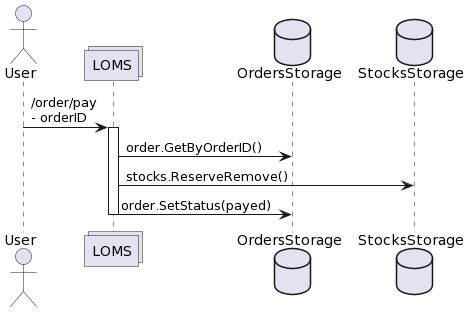
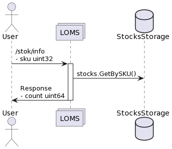

<h1 align="center">Marketplace-service</h1>

  <p align="center">
     Реализация системы, состоящей из нескольких сервисов, которая моделирует работу простого интернет-магазина, включая такие бизнес процессы как:

- добавление товаров в корзину и их удаление из нее

- просмотр содержимого корзины

- оформление заказа по текущему составу корзины

- создание заказа

- оплата заказа

- отмена заказа пользователем или по истечению времени ожидания оплаты

  </p>


## Общее описание
Система состоит из нескольких микросервисов:
- cart - сервис для работы с корзиной пользователя
- loms - сервис для учета заказов и стоков по товарам
- notifier - сервис для обработки уведомлений о статусе заказа


## Архитектура
Микросервисы работают как синхронно (посредством HTTP REST и GRPC), так и асинхронно (с помощью kafka)

Основная часть функционала покрыта тестами, написаны метрики

## Сервис cart:
 - Отвечает за работу с корзиной пользователя
 - Использует HTTP, на основе стандартной библиотеки Go 1.22
 - Для определения существования товара делает поход во внешний сервис (Product Service)
 - Состояние хранит в in-memory
 - Имеет Middleware, который логирует поступающие запросы
 - Делает ретраи в Product Service на 420/429 статус в виде Client Middleware
 - Использует библиотеку minimock для создания моков
 - Настроен линтер для проверки цикломатической и когнитивной сложности
 - Написан бенчмарк для InMemory Storage сервиса Cart
 - Распаралелены вызовы ручки ProductService/ProductService_GetProduct
 - Написан аналог https://pkg.go.dev/golang.org/x/sync/errgroup
 - При общении с Product Service необходимо используется лимит 10 RPS на клиентской стороне

### Спецификация

### Добавить товар в корзину

Идентификатором товара является числовой идентификатор SKU. Метод добавляет указанный товар в корзину
определенного пользователя. Каждый пользователь имеет числовой идентификатор userID. При добавлении в корзину
проверяем, что товар существует в специальном сервисе.

Один и тот же товар может быть добавлен в корзину несколько раз, при этом количество экземпляров складывается.

| Метод | URI                                             |
|-------|-------------------------------------------------|
| POST  | /user/<user_id>/cart/<sku_id>                   |

**Параметры запроса:**

| Параметр | Тип параметра | Тип данных | Пример | Описание                                                        |
|----------|---------------|------------|--------|-----------------------------------------------------------------|
| user_id  | query path    | int64      | 1007   | Идентификатор пользователя в корзину которого добавляется товар |
| sku_id   | query path    | int64      | 2008   | Идентификатор товара, добавляемого в корзину                    |
| count    | body          | uint16     | 12     | Количество товаров, добавляемое в корзину                       |

**Параметры ответа:**

отсутствуют

**Диаграмма последовательности:**


### Удалить товар из корзины

Метод полностью удаляет все количество товара из корзины пользователя. Если у пользователя вовсе нет данной позиции,
то возвращается такой же ответ, как будто бы все позиции данного sku были успешно удалены

| Метод  | URI                                             |
|--------|-------------------------------------------------|
| DELETE | /user/<user_id>/cart/<sku_id>                   |

**Параметры запроса:**

| Параметр | Тип параметра | Тип данных | Пример | Описание                                                        |
|----------|---------------|------------|--------|-----------------------------------------------------------------|
| user_id  | query path    | int64      | 1007   | Идентификатор пользователя в корзину которого добавляется товар |
| sku_id   | query path    | int64      | 2008   | Идентификатор товара, удаляемого из корзины                     |

**Параметры ответа:**

отсутствуют

**Диаграмма последовательности:**


### Очистить корзину пользователя

Метод полностью очищает корзину пользователя. Если у пользователя нет корзины или она пуста, то как и при успешной
очистке корзины необходимо вернуть код ответа 204 No Content.

| Метод  | URI                  |
|--------|----------------------|
| DELETE | /user/<user_id>/cart |

**Параметры запроса:**

| Параметр | Тип параметра | Тип данных | Пример | Описание                                                        |
|----------|---------------|------------|--------|-----------------------------------------------------------------|
| user_id  | query path    | int64      | 1007   | Идентификатор пользователя в корзину которого добавляется товар |

**Параметры ответа:**

отсутствуют

**Диаграмма последовательности:**


### Получить содержимое корзины

Метод возвращает содержимое корзины пользователя на текущий момент. Если корзины у переданного пользователя нет,
либо она пуста, следует вернуть 404 код ответа. Товары в корзине упорядочены в порядке возрастания sku.

| Метод | URI                       |
|-------|---------------------------|
| GET   | /user/<user_id>/cart/list |

**Параметры запроса:**

| Параметр | Тип параметра | Тип данных | Пример | Описание                                                        |
|----------|---------------|------------|--------|-----------------------------------------------------------------|
| user_id  | query path    | int64      | 1007   | Идентификатор пользователя в корзину которого добавляется товар |

**Параметры ответа:**

| Параметр        | Тип данных | Пример                                           | Описание                                     |
|-----------------|------------|--------------------------------------------------|----------------------------------------------|
| items[i].sku_id | int64      | 2008                                             | Идентификатор товара в корзине пользователя  |
| items[i].name   | string     | "Гречка пропаренная, в пакетиках для варки, 400" | Наименование товара                          |
| items[i].count  | uint16     | 10                                               | Количество единиц товара                     |
| items[i].price  | uint32     | 16                                               | Стоимость единицы товара в условных единицах |
| total_price     | uint32     | 160                                              | Суммарная стоимость всех товаров в корзине   |


**Пример ответа:**

```json
{
    "items" : [
        {
            "sku_id": 2958025,
            "name": "Roxy Music. Stranded. Remastered Edition",
            "count": 2,
            "price": 1028
        },
        {
            "sku_id": 773297411,
            "name": "Кроссовки Nike JORDAN",
            "count": 1,
            "price": 2202
        }
    ],
    "total_price": 4258
}
```

**Диаграмма последовательности:**


## Взаимодействие с Product service

## get_product

Request
```
{
    token string
    sku uint32
}
```

Response
```
{
    name string
    price uint32
}
```

## list_skus

Request
```
{
    token string
    startAfterSku uint32
    count uint32
}
```

Response
```
{
    skus []uint32
}
```


## Сервис loms:
- Отвечает за учет заказов и стоки по товарам
- Взаимодействует с cart через gRPC
- gRPC интерцептор на валидацию и логирование
- HTTP-gateway
- swagger-ui с возможностью совершать запросы из swagger к сервису
- автоматические миграции, накатывающие схему БД и тестовые данные
- SQL код написан в виде raw. Используется sqlc
- Используется PostgresSQL. Для БД поднята синхронная реплика. Балансируются read/write запросы между ними (write только в master, read в любую из реплик)
- Для передачи событий о статусах заказа с гарантией доставки не ниже "at least once" использует паттерн tx outbox


## Спецификация LOMS (Logistics and Order Management System)

Сервис отвечает за учет заказов и стоки по товарам.


### OrderCreate

Создает новый заказ для пользователя из списка переданных товаров с резервированием нужного количества стоков
+ заказ получает статус "new"
+ резервирует нужное количество единиц товара
+ если удалось зарезервировать стоки, заказ получает статус "awaiting payment"
+ если не удалось зарезервировать стоки, заказ получает статус "failed"


Request
```
{
    user int64
    items []{
        sku uint32
        count uint16
    }
}
```

Response
```
{
    orderID int64
}
```

### OrderInfo

Показывает информацию по заказу


Request
```
{
    orderID int64
}
```

Response
```
{
    status string // (new | awaiting payment | failed | payed | cancelled)
    user int64
    items []{
        sku uint32
        count uint16
    }
}
```

### OrderPay

Помечает заказ оплаченным. Зарезервированные товары должны перейти в статус купленных.
+ удаляем зарезервированные стоки на товаре
+ заказ получает статус "payed"




Request
```
{
    orderID int64
}
```

Response
```
{}
```

### OrderCancel

Отменяет заказ, снимает резерв со всех товаров в заказе.
+ зарезервированные стоки на товаре становятся свободными стоками
+ заказ получает статус "cancelled"


Request
```
{
    orderID int64
}
```

Response
```
{}
```

### StocksInfo

Возвращает количество товаров, которые можно купить. Если товар был зарезервирован у кого-то в заказе и ждет оплаты, его купить нельзя.
- данные по товарам берутся из stock-data.json (embed)
    - структура stock:
        - sku - товар
        - total_count - всего товаров
        - reserverd - количество зарезервированных



Request
```
{
    sku uint32
}
```

Response
```
{
    count uint64
}
```

# Путь покупки товаров:

- cart/item/add - добавляем в корзину и проверяем, что есть в наличии
- cart/item/delete - можем удалять из корзины
- cart/list - можем получать список товаров корзины
- cart/checkout - приобретаем товары через Checkout
- order/pay - оплачиваем заказ
- order/cancel - отмена заказа до оплаты


## Сервис notifier:
- Принимает сообщения из кафки

## Метрики и логгирование
 -  Возвращаются метрики по API /metrics
 -  Количество запросов
 -  Время исполнения запросов и статус исполнения запросов – статус код, очищенный url
 -  Количество запросов во внешние ресурсы
 -  Время исполнения запросов во внешние ресурсы и статус их исполнения – статус код, очищенный url
 -  Количество запросов в базу - категория запроса (select, update, delete)
 -  Время исполнения запросов и статус запросов в базу (все запросы) – ошибка, категория запроса (select, update, delete)
 -  Количество объектов в in-memory репозитории в сервисе cart
 -  Трейсинг во всей цепочке сервисов
 -  Лог включает в себя имя сервиса, таймстемп лога, trace_id и span_id исполняемого запроса
 -  Сбор профилей pprof по HTTP


